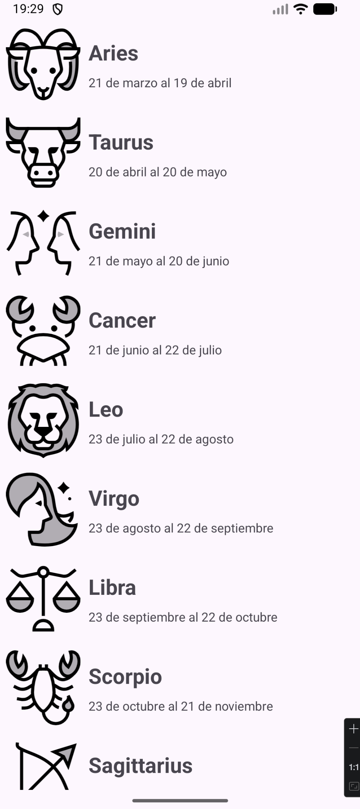
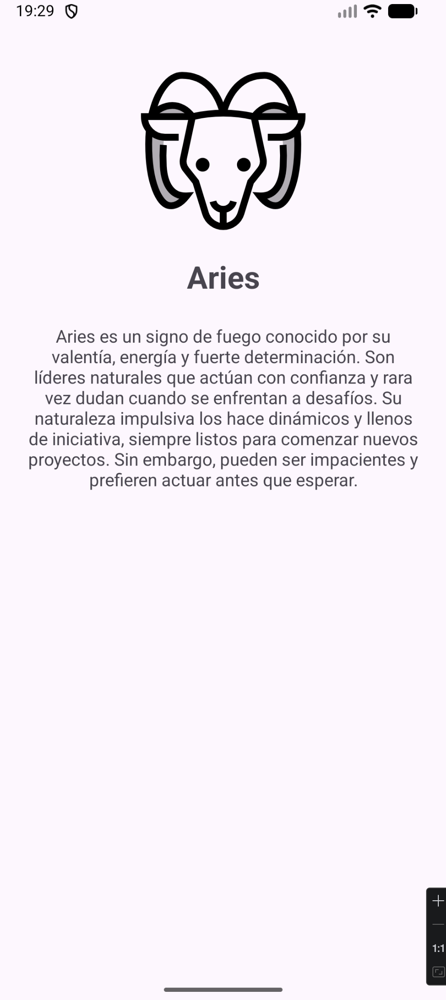

# 🌌 Zodiac App – Android Kotlin (v1.0)

**Descripción:**  
Aplicación nativa de Android desarrollada en Kotlin como proyecto inicial para aprender fundamentos de desarrollo Android.  
Esta primera versión se centra en la visualización de datos mediante un **RecyclerView** y la navegación entre pantallas.

---

## 📌 Funcionalidades

### 🔹 v1.0
- 📋 Lista de signos del zodiaco usando **RecyclerView**  
- 🔍 Navegación a pantalla de detalle al hacer click en un elemento  
- 📦 Envío de datos entre Activities mediante `Intent`  
- 📱 Pantalla de detalle con:
  - Nombre del signo  
  - Imagen representativa  
  - Descripción  
- 🧩 Uso de recursos de Android (`strings.xml`, `drawables`)  
- 🏗 Modelo de datos simple `Horoscope`  

---

## 🛠 Tecnologías utilizadas

- Kotlin  
- Android Studio  
- RecyclerView  
- Intents (Navigation entre Activities)  
- Material Design Components  
- ConstraintLayout  
- Recursos Android (`strings.xml`, `drawables`)  

---

## 📷 Capturas de pantalla

### 🟢 v1.0
<p align="center">
  
  
</p>

---

## 📝 Lo que aprendí

- Creación de interfaces con RecyclerView  
- Uso de Adapters y ViewHolder  
- Navegación entre Activities con Intents  
- Paso básico de datos entre pantallas  
- Uso de recursos en Android  
- Estructura básica de una app Android nativa  

---

## 🚀 Cómo ejecutar

1. Clona el repositorio:

```bash
git clone https://github.com/tuusuario/zodiac_app.git
